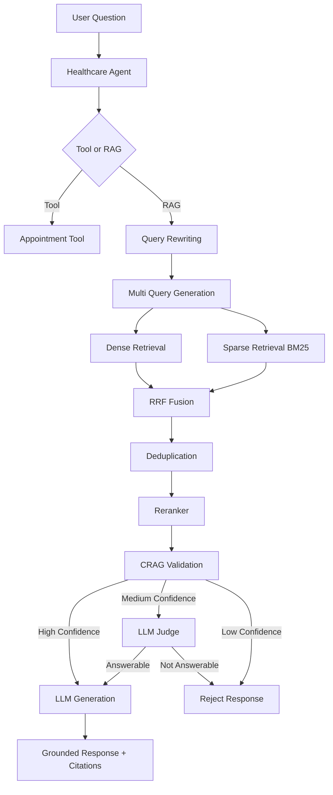
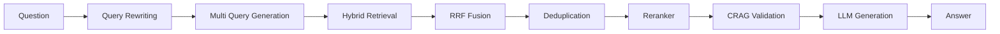

# Healthcare RAG Bot

Production-Oriented Healthcare AI Assistant built using an **Agentic Hybrid RAG with Enhanced Retrieval** architecture.

Repository:

https://github.com/UnbeatableBann/Healthcare-RAG-bot

---

# Overview

Healthcare RAG Bot is a healthcare-focused AI assistant designed to answer questions from healthcare operational and compliance documents using Retrieval-Augmented Generation (RAG).

The system goes beyond a basic RAG implementation by incorporating:

* Hybrid Retrieval (Dense + Sparse)
* Query Rewriting
* Multi Query Retrieval
* Deduplication
* Reciprocal Rank Fusion (RRF)
* Cross-Encoder Reranking
* CRAG-Inspired Retrieval Validation
* LLM-as-a-Judge
* Agent-Based Routing
* Local LLM Support
* RAGAS Evaluation
* Observability and Monitoring

The goal is to generate grounded responses while minimizing hallucinations and providing source citations.

---

# Features

## Document Ingestion

* Markdown document ingestion
* Metadata extraction
* Multiple chunking strategies
* Embedding generation
* Vector indexing in Qdrant

---

## Enhanced Retrieval

* Query rewriting
* Multi-query retrieval
* Dense retrieval
* Sparse retrieval
* Deduplication
* Hybrid search
* Reciprocal Rank Fusion (RRF)

---

## Advanced Retrieval Validation

* Heuristic retrieval evaluation
* LLM-as-a-Judge validation
* Hallucination prevention
* Confidence scoring

---

## Agent Workflow

* Appointment routing
* Tool execution
* RAG execution
* Intent-based orchestration

---

## Evaluation

* RAGAS evaluation
* Context Precision
* Context Recall
* Faithfulness
* Answer Relevancy

---

## Deployment

* Docker
* Docker Compose
* Prometheus
* Grafana

---

# Architecture

## Agentic Hybrid RAG with Enhanced Retrieval



---

# Retrieval Pipeline



---

# Chunking Architecture

The ingestion pipeline supports multiple chunking strategies.

## Recursive Chunking

Used for:

* Policies
* FAQs
* Guidelines

---

## Semantic Chunking

Used for:

* Long healthcare articles
* Educational documents

---

## Contextual Chunking

Used for:

* Procedures
* Workflows
* Multi-step instructions

---

## Hybrid Chunking

Document-aware chunking.

Example:

* Policies → Recursive
* Procedures → Contextual
* Articles → Semantic

---

# Project Structure

```text
healthcare-ai-assistant/

├── apps/
├── core/
├── agent/
├── rag/
├── embeddings/
├── llm/
├── rerankers/
├── vectorstores/
├── evaluation/
├── experiments/
├── tests/
├── data/
├── scripts/
├── Dockerfile
├── docker-compose.yml
├── pyproject.toml
└── README.md
```

---

# Setup Instructions

## Prerequisites

Install:

* Python 3.12+
* Docker
* Docker Compose
* Ollama

---

## Clone Repository

```bash
git clone https://github.com/UnbeatableBann/Healthcare-RAG-bot.git

cd Healthcare-RAG-bot
```

---

## Create Virtual Environment

Using uv:

```bash
uv venv

source .venv/bin/activate
```

Windows:

```bash
.venv\Scripts\activate
```

---

## Install Dependencies

```bash
uv sync
```

---

## Configure Environment

Create:

```bash
.env
```

Example:

```env
APP_NAME=Healthcare AI Assistant

API_HOST=0.0.0.0
API_PORT=8000

QDRANT_URL=http://localhost:6333

LLM_PROVIDER=ollama
LLM_MODEL=llama3.1:8b

EMBEDDING_PROVIDER=bge
EMBEDDING_MODEL=BAAI/bge-small-en-v1.5

RERANKER_PROVIDER=bge
RERANKER_MODEL=BAAI/bge-reranker-base
```

---

# Pull Local LLM

Example:

```bash
ollama pull llama3.1:8b
```

---

# Run Qdrant

```bash
docker run -p 6333:6333 qdrant/qdrant
```

---

# Ingest Documents

```bash
python scripts/ingest.py
```

---

# Run Application

```bash
uvicorn apps.api.main:app --reload
```

---

# API Documentation

```text
http://localhost:8000/docs
```

---

# Docker Setup

## Build

```bash
docker compose build
```

---

## Run

```bash
docker compose up -d
```

---

## Services

```text
FastAPI     : 8000
Qdrant      : 6333
Prometheus  : 9090
Grafana     : 3000
```

---

# API Examples

## Health Check

```bash
curl -X GET \
"http://localhost:8000/api/v1/health"
```

Response:

```json
{
  "status": "healthy"
}
```

---

## Ingest Documents

```bash
curl -X POST \
"http://localhost:8000/api/v1/ingest"
```

Response:

```json
{
  "status": "success",
  "documents": 10,
  "chunks": 432
}
```

---

## Ask Question

```bash
curl -X POST \
"http://localhost:8000/api/v1/ask" \
-H "Content-Type: application/json" \
-d '{
  "question":"Can a patient request medication refills through telehealth?"
}'
```

Response:

```json
{
  "answer":"Patients may request medication refills through telehealth consultations if the medication is eligible for refill and does not require an in-person evaluation.",
  "sources":[
    {
      "document":"medication_refill_policy.md"
    },
    {
      "document":"telehealth_consultation_guidelines.md"
    }
  ],
  "confidence":0.91
}
```

---

# Sample Questions

## Question

```text
Can patients request medication refills through telehealth?
```

Answer:

```text
Yes. Eligible refill requests may be reviewed during telehealth consultations depending on medication requirements and provider assessment.
```

---

## Question

```text
How can patients cancel appointments?
```

Answer:

```text
Appointments may be cancelled through the patient portal, by phone, or by contacting the scheduling department before the cancellation deadline.
```

---

## Question

```text
Does insurance cover telehealth visits?
```

Answer:

```text
Coverage depends on the patient's insurance plan. Patients should verify telehealth coverage during insurance eligibility checks.
```

---

## Question

```text
What medication should I take for diabetes?
```

Answer:

```text
I could not find this information in the provided documents.
```

---

# Dataset Details

All documents are synthetic.

No real patient data is used.

Dataset topics:

* Patient Discharge Instructions
* Appointment Scheduling Policy
* Insurance Eligibility FAQ
* HIPAA Privacy Guidelines
* Medication Refill Policy
* Telehealth Consultation Guidelines
* Urgent Care Services
* Prescription Management Policy
* Patient Portal Usage Guide
* Billing and Payments Policy

The dataset is intentionally designed with overlapping concepts to evaluate retrieval quality.

Examples:

```text
Medication Refill Policy
↔
Telehealth Guidelines

Insurance FAQ
↔
Billing Policy

Patient Portal
↔
HIPAA Guidelines
```

---

# LLM Used

Default:

```text
Llama 3.1 8B
```

Provider:

```text
Ollama
```

Reason:

* Local deployment
* No external API dependency
* Good instruction following
* Suitable for RAG

---

# Embedding Model

Default:

```text
BAAI/bge-small-en-v1.5
```

Reason:

* Strong retrieval quality
* Lightweight
* Fast inference
* Excellent RAG performance

---

# Vector Database

```text
Qdrant
```

Reason:

* Dense retrieval
* Metadata filtering
* Production-ready
* Fast similarity search

---

# Prompting Strategy

The assistant is instructed to:

* Answer only from retrieved context
* Refuse unsupported questions
* Avoid hallucination
* Provide citations
* Maintain professional healthcare language

If sufficient evidence is unavailable:

```text
I could not find this information in the provided documents.
```

---

# Agent Workflow

Single-agent architecture.

Routing logic:

```text
Question
     ↓
Intent Detection
     ↓

Appointment Query?
     ↓
Appointment Tool

Otherwise
     ↓
RAG Pipeline
```

This keeps the system simple and explainable.

---

# Evaluation

RAGAS metrics:

* Context Precision
* Context Recall
* Faithfulness
* Answer Relevancy

Run:

```bash
python scripts/evaluate.py
```

Results are stored in:

```text
evaluation/reports/
```

---

# Experiment Tracking

Results are stored in:

```text
experiments/results.json
```

Tracked information:

* LLM
* Embedding Model
* Reranker
* Chunking Strategy
* RAGAS Scores
* Latency
* Timestamp

---

# Unit Tests

Run:

```bash
pytest tests/unit
```

Coverage includes:

* Chunkers
* Embeddings
* Rerankers
* Agent
* CRAG Components

---

# Integration Tests

Run:

```bash
pytest tests/integration
```

Coverage includes:

* Qdrant
* Ollama
* Retrieval Pipeline

---

# End-to-End Tests

Run:

```bash
pytest tests/e2e
```

Coverage includes:

```text
API
↓
Agent
↓
Retrieval
↓
Generation
↓
Response
```

---

# Limitations

Current limitations:

* Single-agent architecture
* Small synthetic dataset
* English-only dataset
* Local deployment focus
* No authentication
* No user management

---

# Future Improvements

Potential future enhancements:

* Multi-agent workflows
* JWT Authentication
* RBAC
* Multi-tenant support
* Document versioning
* Human feedback loops
* Kubernetes deployment
* Advanced observability
* Production CI/CD pipelines
* Knowledge Graph Integration
* GraphRAG

``` text
```
